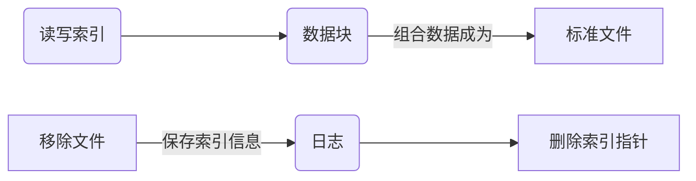

# Linux 意外操作后如何进行数据抢救


在 GUI 中使用  `shift + delete`  组合键或是 CLI 下使用 ``rm -rf`` 删除选项，这个文件并没有从硬盘（或是其它存储设备）上彻底销毁。当它"被删除"以后，OS 将 ``inode`` 的数据指针部分清零，也仅仅是从系统的目录结构中被移除，但是这个文件仍然存在你磁盘中的某个 `block` 物理位置上。（ ``ls -li`` 或 ``stat`` 查询一个文件所对应的 [inode](https://en.wikipedia.org/wiki/Inode) 的元信息数据。 ）。

注意：**[独立硬盘冗余阵列](https://en.wikipedia.org/wiki/RAID)**（**RAID**, **R**edundant **A**rray of **I**ndependent **D**isks）损坏或数据丢失，不在本次范围。

---

**Linux 系统管理员守则中有这么一条：“慎用 rm -rf 命令，除非你知道此命令所带来的后果“**

 <br>

## 一、实验环境

### 1、工具

VMware® Workstation 12 Pro 12.5.2 build-4638234

CentOS-6.5-x86_64-bin-DVD1.iso

### 2、约定

1、所有操作全部在虚拟机环境下完成，使用CentOS操作系统。关闭SELinux！

2、故障模拟如下：

```
# df -hT
* 显示当前系统配置情况，不同测试工具不同环境（每张图可体现是一个崭新的CentOS）
# openssl rand -base64 {num} -out {mount_path/filename}
  使用 openssl 数据工具生成 {num} 位随机数。
# md5sum {mount_path/filename}
* 使用 md5sum 验证工具打印 {mount_path/filename} MD5信息
# rm -rf {mount_path/filename}
  执行 rm -rf {mount_path/filename}
  
"#" 表示权限 "root"、"*" 表示必须截图体现，另特殊情况下也截图。心情好也截图 :)
```

3、测试情况下包括后续内容皆为 “配置好环境变量” 情况下。

```
0、不设置，可这么执行
   {ProgramName}
   /usr/bin/{ProgramName}
   /usr/local/{ProgramName}/bin/{ProgramName} --help
1、设置别名，可永久生效
   alias {ProgramName}="usr/local/{ProgramName}/bin/{ProgramName}"
2、设置环境变量，临时生效
   export PATH=$PATH:/usr/local/{ProgramName}/bin
3、设置程序软链接，永久生效
   ln -s /usr/local/{ProgramName}/bin/{ProgramName}  /usr/bin/{ProgramName}
```

4、实验记录详情：

```
1、数据恢复：
   单个文件（约定2已进行说明）
   文件夹/目录（参见：https://github.com/erlinux/RecoverProject/tree/master/test）
2、更多包括：
   格式支持、界面支持、恢复时长、恢复效果。（详情见文末表格）
```

5、模拟企业真实情况：

```
1、磁盘可卸除挂载
2、恢复程序编译安装
```

6、测试框架皆为：

```
1、通过文件系统的 inode 值（一般是 2 ）来获取文件系统信息。
2、通过上步骤所得出的结论使用 inode 编号以及 filename 进行恢复。
3、通过程序自带的文件夹恢复 或 时间前后恢复 来恢复所删除的数据。
4、通过上述三种步骤所展现的情况（包括其他测试）进行详细的记录用于对比。
```

###3、备注

1、为帮助大家更好理解已进行中文译化。

2、本人仅仅是一名学生，文章不当的地方还请指出。

3、最后祝各位新年快乐。鸡年大吉大利、心想事成、身体健康。（ 就当新年礼物吧 ^_^ ）

<br><br>

## 二、恢复工具

在恢复数据前，要弄清楚俩个概念：inode（索引节点） 和 block （数据块）

block 用于储存数据，inode 用于存储数据属性信息。inode 为每个文件进行信息索引，所以就有了 inode 的数值。




---

### [extundelete][extundelete]


<center>注意：即便不能实现重新只读挂载当前数据盘，也绝对不能在需要恢复文件的目录下进行操作。</center>

#### 1 -> 安装

```
# curl -O https://nchc.dl.sourceforge.net/project/extundelete/extundelete/0.2.4/extundelete-0.2.4.tar.bz2
# tar -jxvf extundelete-0.2.4.tar.bz2 && cd extundelete-0.2.4 
# ./configure --prefix=/usr/local/extundelete
-------------------
configure: error: C++ compiler cannot create executables
# yum install gcc gcc-c++ -y
configure: error: Can't find ext2fs library
# yum install e2fsprogs.x86_64 e2fsprogs-devel.x86_64 e2fsprogs-libs.x86_64  -y
-------------------
make && make install
```

#### 2 --> 选项

```
extundelete --help
用法: extundelete [选项] [--] 设备-文件
选项:
  --version, -[vV]       打印版本并且正常退出.
  --help,                打印帮助并且正常退出.
  --[superblock](http://baike.baidu.com/view/1102790.htm)           
                         除了剩余的内容之外，还打印超级块的内容。
                         默认选项
  --journal              显示日志内容
  --after dtime          只处理在 'dtime' 后被删除的条目
  --before dtime         只处理在 'dtime' 前被删除的条目
功能:
  --inode ino            显示 'ino' 的 索引节点 信息
  --block blk            显示 'blk' 的    块   信息
  --restore-inode ino[,ino,...]
                         恢复具有已知索引节点号 'ino',
                         已恢复的文件在当前目录的RECOVERED_FILES文件夹里创建
                         而文件的索引节点号作为扩展(ie:file.12345)
  --restore-file 'path'  将恢复文件 'path'. 'path' 是相对于根分区而言的，并且不以 '/' 开头
                         已恢复的文件在当前目录的 'RECOVERED_FILES/path'.
  --restore-files 'path' 列出将在 'path' 恢复的文件.
                         每个文件名格式应该与选项 --restore-file 相同，并且每行都应该有一个.
  --restore-directory 'path'
                         恢复文件夹 'path'.
                         'path' 是相对于文件系统的根目录而言的.
                         已恢复的文件夹输出目录在'path'。
  --restore-all          尝试去恢复一切
  -j journal             从一个已命名的文件读取外部日志
  -b blocknumber         当打开系统文件时，使用一个块数字备份超级快.
  -B blocksize           当打开系统文件，使用 blocksize 作为一个块大小.
                         这个数字应该以 bytes 为单位.
  --log 0                程序静默执行
  --log filename         记录所有消息到文件.
  --log D1=0,D2=filename 自定义控制以逗号分隔的日志消息
示例如下:                 列出选项. Dn 必须是 info,warn 或者 error 中一个。
   --log info,error      略去 ‘=name’ 信息中的结果
   --log warn=0          将指定的级别记录到计算机控制台.如果变量为 '=0',指定的级别记录将被关闭.
   --log error=filename  如果变量为'=filename'，写入具有该级别的消息到文件名.
   -o directory          保存恢复的文件到指定目录.
                         默认情况下，恢复的文件被创建在 'RECOVERED_FILES' 文件夹.
```
```
extundelete /dev/sdb1 --inode 2
查找可恢复的数据信息，标记为Deleted状态的是已经删除的文件或目录。
```


```
extundelete /dev/sdb1 --restore-inode 12,13
extundelete /dev/sdb1 --restore-file fstab
extundelete  /dev/sdb1 --after 1293877800  --restore-all
在当前目录的 "RECOVERED_FILES" 下恢复恢复1293877800秒后的所有误删文件
Note: date -d "Jan 01 18:30 2011" +%s
```

#### 3 --> 成功

##### 		① 故障模拟

```
2e4c997cdbdf81b9419297ec156960e0  /mnt/extundelete/extundelete.asdasfsafds-test
```


##### 		② 故障恢复

######文件


######目录


-----

###[ext3grep][ext3grep]


#### 1 -> 安装

```
# wget --no-check-certificate https://github.com/erlinux/RecoverProject/raw/master/soft/ext3grep/ext3grep-0.10.2.zip
Note:please use wget to download file,curl download will be fail.it's hard to say 
# unzip ext3grep-0.10.2.zip && cd ext3grep-0.10.2
# ./configure --prefix=/usr/local/ext3grep
-------------------
configure: error: no acceptable C compiler found in $PATH
# yum -y install gcc
configure: error: C++ preprocessor "/lib/cpp" fails sanity check
# yum -y install gcc-c++
configure: error: Missing headers. Please install the package e2fslibs-dev from e2fsprogs, or http://e2fsprogs.sourceforge.net for the upstream tar-ball.
# yum install -y epel-release && yum install ext2fs  blkid  e2p  uuid
-------------------
# make && make install
```

#### 2 -->选项

```
Running ext3grep version 0.10.2
用法: /usr/local/ext3grep/bin/ext3grep [选项] [--] 设备-文件
选项:
  --version, -[vV]       打印版本并且正常退出.
  --help,                打印帮助并且正常退出.
  --superblock           除了剩余的内容之外，还打印超级块的内容。
                         默认选项
  --print                打印目录块inode号，如果有。
  --ls                   打印目录每个条目只有一行。
                         这个选项通常需要打开过滤。
  --accept filen         允许 'filen' 作为合法文件名，可多次使用
                         如果改变任何 --accept 你必须删除
                         BOTH stage* 文件!
  --accept-all           接受一切作为文件名
  --journal              显示日志内容
  --show-path-inodes     显示路径的每个目录inode号。
过滤:
  --group grp            只处理组 'grp'。
  --directory            只处理目录索引节点。
  --after dtime          仅'dtime' 或之后删除的条目。
  --before dtime         仅'dtime' 或之前删除的条目。
  --deleted              只显示/处理已删除条目。
  --allocated            只显示/处理指定的 inodes/blocks.
  --unallocated          只显示/处理重新分配的 inodes/blocks.
  --reallocated          不限制 inodes 重新分配的条目。
                         如果条目已删除，inode 已分配，文件类型与 dir 条目和 inode 的不同时。Inodes                                  经仔细考虑会被 '重新分配' 
  --zeroed-inodes        不限制 zeroed 索引接点。
                         无论此选项，链接(links)条目都始终显示。
  --depth depth          处理目录递归的深度 'depth'
动作:
  --inode-to-block ino   打印块，使得 inode 包含'ino'
  --inode ino            显示 inode 信息 'ino'.
                         如果使用 --ls 并且 inode 是一个目录，那么过滤器应用于文件夹条目。
                         如果你不使用 --ls 那么 --print 是默认的。
  --block blk            显示块信息 'blk'.
                         如果使用 --ls 并且块是目录的第一个块，那么过滤器应用于目录条目
                         如果你不使用 --ls 那么 --print 是默认的。
  --histogram=[atime|ctime|mtime|dtime|group]
                         根据给定的规格生成树状图。
                         使用 atime，ctime,或者 mtime 将改变 --after and --before 意思
  --journal-block jblk   显示日志块信息 'jblk'.
  --journal-transaction seq
                         用连续的数字'seq' 显示处理信息
  --dump-names           将文件路径写入标准输出
                         这意味着 --ls 但限制它的输出。
  --search-start str     查找以固定字符串'str'开头的块
  --search str           查找包含固定字符串 "str" 的块。
  --search-inode blk     查找Find inodes that refer to block 'blk'.
  --search-zeroed-inodes 返回分配为零的 inode 条目表。
  --inode-dirblock-table dir
                         为目录路径为 'dir' 找到 block 号和每个已使用的 inodes 节点打印一个表
  --show-journal-inodes ino
                         始终在日志显示 inode 'ino'副本
  --restore-inode ino[@seqnr][,ino[@seqnr],...]
                         恢复具有已知 inode 号的文件。
                         恢复文件将被创建在./RESTORED_FILES/
                         而文件的索引节点号作为扩展(ie:file.12345)
                         除非 '@seqnr' 提供使用了序列号的日志条目，不然的话使用最后一个条目。
                         在一个文件被重写或被删节这种情况下你可以使用这个，而不是删除。
  --restore-file 'path' [--restore-file 'path' ...]
                         将恢复文件 'path'. 'path' 是相对于根分区而言的，并且不以 '/' 开头 (
                         它必须成为由 --dump-names 返回的路径之一 ).
                         已恢复的目录、文件、被创建在'RESTORED_FILES/path'.
  --restore-all          虽然还是 --restore-file 但是程序会尝试去恢复一切.
                         推荐使用 --after 。因为尝试恢复很旧的文件会导致他们被硬链接到最近删除的文件
                         并且如此操作输出量的可能性就越大。
  --show-hardlinks       显示所有由俩个或多个共享的 inodes
```

```
ext3grep /dev/sdb1 --inode 2
查看 indoe 为 2 的目录
ext3grep /dev/sdb1 --dump-names
列出 /dev/sdb1 下的所有文件
ext3grep /dev/sdb1 --restore-all
恢复 /dev/sdb1 下所有文件
```

#### 3 -->成功

##### 		① 故障模拟

```
289f73b0b41489dfaa98f5eb094a382b  /mnt/ext3grep/ext3grep_ashndiasdnaind_test
```


##### 		② 故障恢复

###### 文件


###### 目录

<font color=red>ext3grep 并没有像 "extundelete" 一样提供恢复目录选项（也许我没发现），所以恢复目录可以曲线救国法使用"before&after"进行文件夹恢复<br>另外在需要计算秒数的 ```date``` 命令可以这么使用```$(date -d "-1 hour" +%s) ```</font>


其他


<font color=yellow>该工具仅能恢复 ext3 文件系统。</font>

---

###[ext4magic][ext4magic]


#### 1 -> 安装

```
# wget --no-check-certificate https://github.com/erlinux/RecoverProject/raw/master/soft/ext4magic/ext4magic-0.3.2.tar.gz
# tar -zxvf ext4magic-0.3.2.tar.gz && cd ext4magic-0.3.2
# ./configure --prefix=/usr/local/ext4magic/
---------------
configure: error: no acceptable C compiler found in $PATH
# yum install gcc -y
configure: error: You must install the develop packages "ext2fs , blkid , e2p , uuid" to build ext4magic
# 无法解决，改用 home_robi-1 仓库安装
----------------
yum --enablerepo=home_robi-1 install ext4magic  -y
WebSite:http://download.opensuse.org/repositories/home:/robi-1/CentOS_CentOS-6/
```

#### 2 -->选项

```
  范例
              打印目录的 Inode，这有一些可能性。

               # ext4magic /dev/sda3 -f /
               # ext4magic /dev/sda3 -I 2

              在第一示例中，输出的是文件系统根目录实际索引节点。
              在第二示例中，输入路径名称也是根目录。 即：Inode 2                                            


               # ext4magic /tmp/filesystem.iso -f / -T -x

              使用文件系统镜像 "/tmp/filesystem.iso",
              搜索并且打印所有 Block 包括根 Inode，并且打印所有不同的 Inode。(包含数据块的块列表)
              如果是目录，那么还要为每个 Inode 打印目录的内容。
              
              
               #  ext4magic /tmp/filesystem.iso -j /tmp/journal.backup -I 8195
              -t 182                                                          

              使用文件系统镜像 "/tmp/filesystem.iso" 并且读取从外部日志 "/tmp/journal.backup" 
              从日志处理 182 编号的 Inode 8195 编号。
     
     
               #  ext4magic /dev/sda3 -f user1/Documents -a $(date -d "-3 day"
              +%s) -b $(date -d "-2 day" +%s)                                 

              打印俩到三天前被删除的路径名 "user1/Documents" 的索引数据。 
              如果它是一个目录，那么（也打印）这个目录的内容。
              如果在日志找不到旧目录 blocks，目录内容将从文件系统真实内容。         


       简单实例

               # ext4magic /dev/sda3 -r -f user1/picture/cim01234.jpg -d /tmp

              恢复文件刚刚被删除 "/home/user1/picture/cim01234.jpg" .
              文件系统已正常挂载 "/home".文件路径规定从指定的文件系统根目录并不是整个 Linux 根目录
              不卸载文件系统是不可能的，文件将被写在 "/tmp/user1/picture/cim01234.jpg"                     

               # ext4magic /dev/sda3 -r

              尝试恢复在24小时前删除的所有文件，文件写在"./RECOVERDIR/"内                                   


               # ext4magic /dev/sda3 -R -a $(date -d "-5day" +%s)

              尝试恢复所有文件，即使如果他们有些已经被重写，也能恢复所有没有删除的文件。
              删除发生在四天前。                             


               # ext4magic /dev/sda3 -M -d /home/recover

              尝试多阶段的恢复所有文件在文件系统已经 "rm -rf *".
              文件写入  "/home/recover".
              (on ext4: in this version skipped the last step.)              


               #  ext4magic  /dev/sda3 -RQ -f user1/Dokuments -a 1274210280 -b
              1274211280 -d /mnt/testrecover

              尝试恢复目录结构 "user1/Dokuments/". "-b" 时间戳，你必须设置删除前的文件，
              "-a" 时间戳阻止找到旧的文件版本。这只会更好的工作。
              如果你有创建或删除文件在 "-b" 时间戳。（它会被）写入目录 "/mnt/testrecover"
              如果只有少数文件恢复，同时尝试不用选项 -Q


               #  ext4magic  /home/filesystem.iso -Lx  -f user1 | grep "jpg" >
              ./tmpfile

               #  ext4magic   /home/filesystem.iso   -i   ./tmpfile   -r   -d
              /mnt/testrecover

              尝试只恢复所有从目录结构"user1/"，删除的文件在文件名具有 "jpg" (超过 24 小时)  
              并且写入进 "/mnt/testrecover"  - 使用一个临时文件 "./tmpfile" 用于文件名列表。


BUGS
       直接使用当前可读写的日志打开文件系统会读取产生坏块。
       这个坏块提供程序错误结果和不真实的结果。
       因此你应该永不使用这种文件系统，直接处于开放读写下的日志
       如果有必要，使用挂载过的文件系统，创建文件系统日志副本并且使用 -j 选项。


作者
       Roberto Maar
译者
       jiwenkang

更多参见
       debugfs (8) , e2fsck (8)
```

```
-I             -> inode        索引节点，+数字
-f             -> path         目录位置，+位置

ext4magic {sdx} -r/-R             ->        recover all (程度较低)
ext4magic {sdx} -M                ->        recover all (程度很强)
ext4magic {sdx} -rf {path/files}  ->        recover file
ext4magic {sdx} -d  {path}        ->        recover to diresotry
```

#### 3 -->成功

###### 		① 故障模拟

```
c466f4672a18ee37ba5197e4d264d6ef  /mnt/ext4magic1/ext4magic1_111111
33dd6934d4a26c7fcb8a829c98fba1fb  /mnt/ext4magic2/ext4magic1_222222
```


###### ② 故障恢复

###### 文件


###### 目录


---

### [TestDisk][photoRec]


#### 1 -> 安装

```
# wget --no-check-certificate  https://raw.githubusercontent.com/erlinux/RecoverProject/master/soft/testdisk/testdisk-7.0.linux26-x86_64.tar.bz2
# tar -jxvf testdisk-7.0.linux26-x86_64.tar.bz2 && cd testdisk-7.0
# ./testdisk-7.0/testdisk_static
```

#### 2 --> 选项

```
Use arrow keys to select, then press Enter key:
>[ Create ] Create a new log file
 [ Append ] Append information to log file
 [ No Log ] Don't record anything

使用箭头键选择，然后按Enter键：
>[ 创建 ] 创建一个新日志文件
 [ 附加 ] 将信息附加到日志文件
 [ 为空 ] 不使用日志记录任何内容
 
注意：必须正确检测磁盘容量才能成功恢复。
如果上面列出的磁盘大小不正确，请检查HD跳线设置，审查BIOS。以及安装最新的操作系统补丁和磁盘驱动程序。
```

```
Please select the partition table type, press Enter when done.
>[Intel  ] Intel/PC partition
 [EFI GPT] EFI GPT partition map (Mac i386, some x86_64...)
 [Humax  ] Humax partition table
 [Mac    ] Apple partition map
 [None   ] Non partitioned media
 [Sun    ] Sun Solaris partition
 [XBox   ] XBox partition
 [Return ] Return to disk selection

请选择分区表类型，完成后按Enter键。
>[英特尔  ] 英特尔/ PC分区
 [EFI GPT] EFI GPT 分区map (Mac i386, 某些 x86_64...)
 [Humax  ] Humax 分区表
 [Mac    ] Apple 分区map
 [None   ] Non 分区介质
 [Sun    ] Sun Solaris 分区
 [XBox   ] XBox 分区
 [返回   ] 回到磁盘选择
 
提示：已检测到Intel分区表类型。
注意：不要为只有单个分区的介质选择“None”。 很少将磁盘设置为“未分区”。
```

```
>[ Analyse  ] Analyse current partition structure and search for lost partitions
 [ Advanced ] Filesystem Utils
 [ Geometry ] Change disk geometry
 [ Options  ] Modify options
 [ Quit     ] Return to disk selection

 [ 分析 ] 分析当前分区结构并搜索丢失的分区
 [ 高级 ] 文件系统实用程序
 [3D参数] 更改磁盘3D参数（Disk Geometry)，即磁头数（Heads），柱面数（Cylinders），扇区数（Sectors）
>[ 选项 ] 选项修改
 [ 退出 ] 回到磁盘选择
 
 注意：恢复成功需要正确的磁盘3D参数。如果它认为分区3D参数不匹配, 'Analyse'进程可能会给出一些警告.
 专家模式 : No
 分区对齐 : Yes
 数据转储 : No
```

```
 专家模式 : No 分区对齐 : Yes 数据转储 : No
```

#### 3 -->成功

##### ① 故障模拟

```
a524bb0892750dfe2c2a91c819bf9861  /mnt/testdisk/testdisk123123
```


##### ②故障恢复

###### 文件


###### 目录


----

### [foremost](foremost)


#### 1 -> 安装

````
# wget --no-check-certificate https://github.com/erlinux/RecoverProject/raw/master/soft/foremost/foremost-1.5.7.tar.gz
# tar -zxvf foremost-1.5.7.tar.gz  && cd foremost-1.5.7
# make
------------------
make: gcc：command not found
# yum -y install gcc
------------------
# make install
````

#### 2 --> 选项

```
foremost version 1.5.7 by Jesse Kornblum, Kris Kendall, and Nick Mikus.
$ foremost [-v|-V|-h|-T|-Q|-q|-a|-w-d] [-t <type>] [-s <blocks>] [-k <size>] 
	[-b <size>] [-c <file>] [-o <dir>] [-i <file] 

-V  - 显示版权信息并退出。
-t  - 列出文件类型 (-t jpeg,pdf ...) 
-d  - 间接打开块检测 (for UNIX file-systems) 
-i  - 指定输入文件 (默认标准输入) 
-a  - 写入所有头，不执行错误检测 (已损坏的文件) 
-w  - 只写入审计文件，不要将任何检测到的文件写入磁盘
-o  - 设置输出目录 (默认标准输出)
-c  - 设置需要使用的配置文件 (默认 foremost.conf)
-q  - 开启安静模式.搜索在 512 字节范围执行。
-Q  - 开启安静模式.禁止内容输出。
-v  - 详细模式.屏幕显示所有日志信息。、
```

```
Foremost 支持恢复如下格式：avi, bmp, dll, doc, exe, gif, htm, jar, jpg, mbd, mov, mpg, pdf, png, ppt, rar, rif, sdw, sx, sxc, sxi, sxw, vis, wav, wmv, xls, zip。
```

#### 3 -->失败

**文件恢复不存在、MD5校检不匹配。恢复失败**


```
bc9bf6b494ad114e7cb2cfd0003a0a0b  /mnt/formost/foremost_asnfasoindosnd.htm
```


---

###[safecopy](safecopy)


#### 1 -> 安装

```
# wget --no-check-certificate https://downloads.sourceforge.net/project/safecopy/safecopy/safecopy-1.7/safecopy-1.7.tar.gz https://raw.githubusercontent.com/erlinux/RecoverProject/master/soft/safecopy/safecopy-1.7.tar.gz
# tar -zxvf safecopy-1.7.tar.gz  && cd safecopy-1.7
# ./configure --prefix=/usr/local/safecopy/
------------
configure: error: no acceptable C compiler found in $PATH
# yum -y install gcc
-------------
make && make install
ln -s /usr/local/safecopy/bin/safecopy /usr/bin/
```

#### 2 --> 选项

```
Safecopy 1.7 by CorvusCorax
用法: safecopy [选项] <源> <目标>
选项:
	--stage1 : 预设快速挽救大部分数据，使用无重操作并且避免坏区。
	           预设: -f 10% -r 10% -R 1 -Z 0 -L 2 -M BaDbLoCk
	                    -o stage1.badblocks
	--stage2 : 预设以挽救更多数据, 使用无重操作但搜索坏区的精确结束。
	           预设: -f 128* -r 1* -R 1 -Z 0 -L 2
	                    -I stage1.badblocks
	                    -o stage2.badblocks
	--stage3 : 预设使用最大重试次数抢救可以被头部调整技巧和低级访挽救出的一切。
	           预设: -f 1* -r 1* -R 4 -Z 1 -L 2
	                    -I stage2.badblocks
	                    -o stage3.badblocks
	所有阶段预设都可以被单个选项覆盖。
	-b <size> : 块大小默认用于读取操作。为你的媒体设备设置物理扇区大小
	            Default: 1*
	            如果由OS报告的，硬件块大小使用 4096
	-f <size> : 跳过坏块时的块大小。
	            设置更高减少了您的硬件压力，但你可能会错失两个坏块之间良好的区域。
	            Default: 16*
	-r <size> : 以字节为单位精确搜索坏区的开始或结束。
	            如果您直接从设备读取数据，则无需将其设置为低于硬件块大小。
	            然而在已挂载的文件系统上，读取硬件块的块大小可能未对齐。
	            较小的值会导致数据读取在数据损坏边缘尝试，会增大已损坏的介质。
	            Default: 1*
	-R <number> : 至少对具有最小程度率损坏区域的第一个坏块进行许多读取尝试。
	              更多的尝试有时可以修复欠佳的扇区，当更增加成本。
	              Default: 3
	-Z <number> : 对每一个错误，使用强制规定设备从头到尾读取头部。
	              这需要时间，应变额外产生的可能，不受所有设备或驱动程序支持T
	              Default: 1
	-L <mode> : 使用调用指定等级的低级设备:
	                   0  设备调用不允许使用低级别
	                   1  仅为恢复错误尝试低级别程序调用
	                   2  如果可以始终使用低级别程序调用
	            此版本中支持的低级功能包括：
	                系统  设备类型   特征
	                Linux   cdrom/dvd     总线/设备复位
	                Linux   cdrom         读取扇区
	                Linux   floppy        控制器复位
	            Default: 1
	--sync : 同步使用读取调用 (禁用驱动器缓冲)。
	         操作系统如果支持，Safecopy 将使用 O_DIRECT，否则使用 O_SYNC。
	         默认值：允许操作系统进行异步读缓冲
	--forceopen : 在读取错误后继续尝试去重新打开源设备
	              对暂时损坏的USB设备非常有帮助。
	              Warning: 这可能会导致 Safecopy hang 直到手动中止！
	              默认值: 中止 fopen（）错误
	-s <blocks> : 起始位置开始阅读。
	              将与目标文件中的位置 0 相对应。
	              默认值:  block 0
	-l <blocks> : 要读取的数据最大长度。
	              默认值: 输入文件的全部大小
	-I <badblockfile> : 增量模式。假设目标文件已经存在并且具有特定的地方在坏块文件
	                    它将尝试从列出的blocks恢复更多数据或超出目标文件的文件大小。
	                    Warning: 如果没有此选项，目标文件将在写入之前清空。
	                    使用 -I /dev/null 如果您想继续运行以前 safecopy 没有坏块列表。
	                    隐含: -c 0 如果 -c 未指定
	                    默认: none ( /dev/null 如果 -c is 给定 )
	-i <bytes> : 给定 "-I" 来解释坏block文件
	             Default: 使用 "-b" 规定坏块的大小
	-c <blocks> : 继续在这个位置复制。如果输出是一个具有固定大小与可扩展相对的block设备，则允许继续。
                   safecopy不能确定它已经处于多远的地方
				 这个块大小使用同 -I 选项。-c 0 在当前目标大小将会继续。
	              隐含: -I /dev/null 如果 -I 没有被定义
	              默认: none, 0 如果 -I 被定义
	-X <badblockfile> : 排除模式。如果与-I一起使用，排除 blocks 优先于包含 blocks。
		                Safecopy 将不能读写任何数据从排除的blocks恢复区域
	                    默认值: none ( 0 如果 -I 被定义 ) 
	-x <bytes> : 给定 -X 使块大小去解释坏块文件。
	                    默认值：使用-B 规定块大小
	-o <badblockfile> : 写入一个 badblocks/e2fsck 可以并存 bad block 文件.
	                    默认值: none
	-S <seekscript> : 使用外部脚本去寻找输入文件。(可能对磁带设备和类似的有用).
	                  Seekscript 必须是一个可以执行的文件。
	                  将要跳过的块数作为argv1（1-64），块大小（字节）为argv2，当前位置（字节）为argv3。
	                  成果跳过需要返回值是块数或者 0 表示寻找失败。
	                  外部seekscript只会在lseek（）失败时使用，我们需要跳过数据。
	                   默认值: none
	-M <string> : 标记这个没有回收的字符串，而不是跳过它。
				 这有助于以后在救援的文件系统映像上查找损坏的文件。
				 默认值是在无法读取数据时创建输出文件，并将数据保留在任何后续运行中。
	              Warning: 当与增量模式（-I）组合使用时，这可能覆盖 -I 文件中发生的任何块中的数据。 
	              不在-I文件中或由-X指定的文件覆盖的块不会被覆盖。
	              默认值: none
	--debug <level> : 启用调试输出。 级别是一个位字段，
	                     将值添加到一起以获取更多信息：
	                     控制流程:     1
	                     IO　控制:     2
	                     坏块标记:     4
	                     寻    求:     8
	                     增量模式:     16
	                     排除模式:     32
	                  或用于所有调试输出: 255
	                  默认值:  0
	-T <timingfile> : 将扇区读取定时信息写入此文件以供稍后分析。
	                  默认值: none
	-h | --help : Show this text

有效参数 for -f -r -b <size> 选项是:
	<integer>	字节数 - i.e. 1024
	<percentage>%	整个文件/设备大小的百分比 - e.g. 10%
	<number>*	-b only, 操作系统报告的块数
	<number>*	-f and -r only, only，number乘以-b的值

输出描述:
	. : 成功读取1到1024个块。
	_ : 读取块不完整。 （可能文件结束）
	    块大小现在减少读取其余。
	|/| : 查找失败，源只能顺序读取。
	> : 读取失败，减少块大小以读取部分数据。
	! : 读取尝试的最小允许大小的低级错误导致重试尝试。
	[xx](+yy){ : 当前块和连续不断读取成功的字节数。
	X : 在具有最小块大小的块上读取失败，并被跳过。
	    不可恢复的错误，目标文件用零填充。
	    数据现在被跳过，直到到达不可读区域的结束。
	< : 在坏区域结束之后成功读取的导致具有较小块大小的足迹以搜索第一个可读数据。
	}[xx](+yy) : 当前块和最近连续不可读数据的字节数。

Copyright 2012 CorvusCorax
这是免费软件。 
您可以根据GNU通用公共许可证第2版或更高版本的条款重新分发它的副本。
	<http://www.gnu.org/licenses/gpl2.html>.
在法律允许的范围内，不提供任何担保。
```

#### 3、无环境，暂译

----


### 三、综合展示

| 功能\名字 |      extundelete      |        ext3grep         |              ext4magic              | testdisk              |
| :---: | :-------------------: | :---------------------: | :---------------------------------: | --------------------- |
| 分区支持  |     ext3<br>ext4      |          ext3           |            ext3<br>ext4             | ALL                   |
| 扫描时长  |          3s           |           3s            |                 0s                  | 1s-20s                |
| 恢复时长  |          2s           |           1s            |                 1s                  | 1s                    |
| 界面支持  |          CLI          |           CLI           |                 CLI                 | GLI                   |
| 恢复程度  |         100%          |          100%           |                100%                 | 100%                  |
| 程序优势  |     操作简单<br>支持了ext3和ext4      | 输出信息具体<br>恢复效果较好 |    支持格式多<br>输出信息规范<br>前俩者的加强升级版     | 全平台<br>字符界面<br>对新手友好  |
| 总体评价  | :heart::heart::heart: |     :heart::heart:      | :heart::heart::heart::heart::heart: | :heart::heart::heart: |


本文作者是一位开源理念的坚定支持者，所以本文虽然不是软件，但是遵照开源的精神发布。

- 无担保：本文作者不保证作品内容准确无误，亦不承担任何由于使用此文档所导致的损失。
- 自由使用：任何人都可以自由的阅读/链接/打印此文档，无需任何附加条件。
- 名誉权：任何人都可以自由的转载/引用/再创作此文档，但必须保留作者署名并注明出处。

[extundelete]:http://extundelete.sourceforge.net	"完成"
[ext3grep]:http://code.google.com/p/ext3grep/	"完成"
[ext4magic]:http://ext4magic.sourceforge.net/ext4magic_en.html	"完成"

[foremost]:http://foremost.sourceforge.net/	"失败"

[photoRec]:http://www.cgsecurity.org/wiki/	"同一样东西"

[testdisk]:http://www.cgsecurity.org/wiki/	"同一样东西"

[safecopy]:http://safecopy.sourceforge.net/	"仅翻译"
