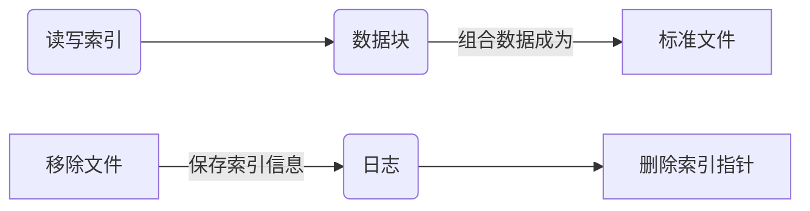

# Linux 意外操作后如何进行数据抢救


在 GUI 中使用  `shift + delete`  组合键或是 CLI 下使用 ``rm -rf`` 删除选项，这个文件并没有从硬盘（或是其它存储设备）上彻底销毁。当它文件被删除以后，``inode`` 的数据指针部分被清零，仅仅是从系统的目录结构中被移除，但是这个文件仍然存在你磁盘中的某个 `block` 物理位置上。（ ``ls -li`` 或 ``stat`` 查询一个文件所对应的 [inode](https://en.wikipedia.org/wiki/Inode) 的元信息数据。 ）。

注意：**[独立硬盘冗余阵列](https://en.wikipedia.org/wiki/RAID)**（**RAID**, **R**edundant **A**rray of **I**ndependent **D**isks）损坏或数据丢失，不在本次范围。

---

**Linux 系统管理员守则中有这么一条：“慎用 rm -rf 命令，除非你知道此命令所带来的后果“**

 <br>

## 一、实验环境

### 1、工具

VMware® Workstation 12 Pro 12.5.2 build-4638234

CentOS-6.5-x86_64-bin-DVD1.iso

### 2、约定

1、所有操作全部在虚拟机环境下完成，使用CentOS操作系统。关闭SELinux！

2、故障模拟如下：

```
# df -hT
* 显示当前系统配置情况，不同测试工具不同环境（每张图可体现是一个崭新的CentOS）
# openssl rand -base64 {num} -out {mount_path/filename}
  使用 openssl 数据工具生成 {num} 位随机数。
# sed -i '1i {content}' "{mount_path/filename}"
  使用 sed 文本工具在首行(1i)添加 {content} 内容。
# md5sum {mount_path/filename}
* 使用 md5sum 验证工具打印 {mount_path/filename} MD5信息
# test -s {mount_path/filename} && rm -rf {mount_path/filename}
  使用 test 判定工具检测 {mount_path/filename} 存在并且不为空
  上述满足则执行 rm -rf {mount_path/filename}
  
"#" 表示权限 "root"、"*" 表示必须截图体现、另特殊情况下也截图。心情好也截图 :)
```

3、测试情况下包括后续内容皆为 “配置好环境变量” 情况下。

```
0、什么都不设置
   {ProgramName}
   /usr/bin/{ProgramName}
   /usr/local/{ProgramName}/bin/{ProgramName} --help
1、设置别名，可永久生效
   alias {ProgramName}="usr/local/{ProgramName}/bin/{ProgramName}"
2、设置环境变量，临时生效
   export PATH=$PATH:/usr/local/{ProgramName}/bin
3、设置程序软链接，永久生效
   ln -s /usr/local/{ProgramName}/bin/{ProgramName}  /usr/bin/{ProgramName}
```

4、恢复实验详情：

```
1、数据恢复包括：
   单个文件（约定2已进行说明）
   文件夹/目录（参见：https://github.com/erlinux/RecoverDateProject/tree/master/test）
2、更多测试包括：
   格式支持、界面支持、恢复时长、恢复效果。（详情见文末表格）
```

5、模拟企业真实情况：

```
1、磁盘可卸除挂载
2、恢复程序编译安装
```

6、测试框架皆为：

```
1、通过文件系统的 inode 值（一般是 2 ）来获取文件系统信息。
2、通过上步骤所得出的结论使用 inode 编号以及 filename 进行恢复。
3、通过程序自带的文件夹恢复 或 时间前后恢复 来恢复所删除的数据。
4、通过上述三种步骤所展现的情况（包括其他测试）进行详细的记录用于对比。
```

###3、备注

1、为帮助大家更好理解已进行中文译化。

2、本人仅仅是一名学生，文章不当的地方还请指出。

3、最后祝各位新年快乐。鸡年大吉大利、心想事成、身体健康。（ 就当新年礼物吧 ^_^ ）

<br><br>

## 二、恢复工具

在恢复数据前，要弄清楚俩个概念：inode（索引节点） 和 block （数据块）

block 用于储存数据，inode 用于存储数据属性信息。inode 为每个文件进行信息索引，所以就有了 inode 的数值。



---

<br>

### [extundelete][extundelete]


<center>注意：即便不能实现重新只读挂载当前数据盘，也绝对不能在需要恢复文件的目录下进行操作。</center>

#### 1 -> 安装

```
# curl -O https://nchc.dl.sourceforge.net/project/extundelete/extundelete/0.2.4/extundelete-0.2.4.tar.bz2
# tar -jxvf extundelete-0.2.4.tar.bz2 && cd extundelete-0.2.4 
# ./configure --prefix=/usr/local/extundelete
-------------------
configure: error: C++ compiler cannot create executables
# yum install gcc gcc-c++ -y
configure: error: Can't find ext2fs library
# yum install e2fsprogs.x86_64 e2fsprogs-devel.x86_64 e2fsprogs-libs.x86_64  -y
-------------------
make && make install
```

#### 2 --> 选项

```
extundelete --help
用法: extundelete [选项] [--] 设备-文件
选项:
  --version, -[vV]       打印版本并且正常退出.
  --help,                打印帮助并且正常退出.
  --[superblock](http://baike.baidu.com/view/1102790.htm)           
                         除了剩余的内容之外，还打印超级块的内容。
                         默认选项
  --journal              显示日志内容
  --after dtime          只处理在 'dtime' 后被删除的条目
  --before dtime         只处理在 'dtime' 前被删除的条目
功能:
  --inode ino            显示 'ino' 的 索引节点 信息
  --block blk            显示 'blk' 的    块   信息
  --restore-inode ino[,ino,...]
                         恢复具有已知索引节点号 'ino',
                         已恢复的文件在当前目录的RECOVERED_FILES文件夹里创建
                         而文件的索引节点号作为扩展(ie:file.12345)
  --restore-file 'path'  将恢复文件 'path'. 'path' 是相对于根分区而言的，并且不以 '/' 开头
                         已恢复的文件在当前目录的 'RECOVERED_FILES/path'.
  --restore-files 'path' 列出将在 'path' 恢复的文件.
                         每个文件名格式应该与选项 --restore-file 相同，并且每行都应该有一个.
  --restore-directory 'path'
                         恢复文件夹 'path'.
                         'path' 是相对于文件系统的根目录而言的.
                         已恢复的文件夹输出目录在'path'。
  --restore-all          尝试去恢复一切
  -j journal             从一个已命名的文件读取外部日志
  -b blocknumber         当打开系统文件时，使用一个块数字备份超级快.
  -B blocksize           当打开系统文件，使用 blocksize 作为一个块大小.
                         这个数字应该以 bytes 为单位.
  --log 0                程序静默执行
  --log filename         记录所有消息到文件.
  --log D1=0,D2=filename 自定义控制以逗号分隔的日志消息
示例如下:                 列出选项. Dn 必须是 info,warn 或者 error 中一个。
   --log info,error      略去 ‘=name’ 信息中的结果
   --log warn=0          将指定的级别记录到计算机控制台.如果变量为 '=0',指定的级别记录将被关闭.
   --log error=filename  如果变量为'=filename'，写入具有该级别的消息到文件名.
   -o directory          保存恢复的文件到指定目录.
                         默认情况下，恢复的文件被创建在 'RECOVERED_FILES' 文件夹.
```
```
extundelete /dev/sdb1 --inode 2
查找可恢复的数据信息，标记为Deleted状态的是已经删除的文件或目录。
```


```
extundelete /dev/sdb1 --restore-inode 12,13
extundelete /dev/sdb1 --restore-file fstab
extundelete  /dev/sdb1 --after 1293877800  --restore-all
在当前目录的 "RECOVERED_FILES" 下恢复恢复1293877800秒后的所有误删文件
Note: date -d "Jan 01 18:30 2011" +%s
```

#### 3 --> 开始

##### 		① 模拟故障

```
2e4c997cdbdf81b9419297ec156960e0  /mnt/extundelete/extundelete.asdasfsafds-test
```


##### 		② 故障恢复

######文件


######目录


-----

 <br>

###[ext3grep][ext3grep]


#### 1 -> 安装

```
# wget --no-check-certificate https://github.com/erlinux/RecoverProject/raw/master/soft/ext3grep/ext3grep-0.10.2.zip
Note:please use wget to download file,curl download will be fail.it's hard to say 
# unzip ext3grep-0.10.2.zip && cd ext3grep-0.10.2
# ./configure --prefix=/usr/local/ext3grep
-------------------
configure: error: no acceptable C compiler found in $PATH
# yum -y install gcc
configure: error: C++ preprocessor "/lib/cpp" fails sanity check
# yum -y install gcc-c++
configure: error: Missing headers. Please install the package e2fslibs-dev from e2fsprogs, or http://e2fsprogs.sourceforge.net for the upstream tar-ball.
# yum install -y epel-release && yum install ext2fs  blkid  e2p  uuid
-------------------
# make && make install
```

#### 2 -->选项

```
Running ext3grep version 0.10.2
用法: /usr/local/ext3grep/bin/ext3grep [选项] [--] 设备-文件
选项:
  --version, -[vV]       打印版本并且正常退出.
  --help,                打印帮助并且正常退出.
  --superblock           除了剩余的内容之外，还打印超级块的内容。
                         默认选项
  --print                打印目录块inode号，如果有。
  --ls                   打印目录每个条目只有一行。
                         这个选项通常需要打开过滤。
  --accept filen         允许 'filen' 作为合法文件名，可多次使用
                         如果改变任何 --accept 你必须删除
                         BOTH stage* 文件!
  --accept-all           接受一切作为文件名
  --journal              显示日志内容
  --show-path-inodes     显示路径的每个目录inode号。
过滤:
  --group grp            只处理组 'grp'。
  --directory            只处理目录索引节点。
  --after dtime          仅'dtime' 或之后删除的条目。
  --before dtime         仅'dtime' 或之前删除的条目。
  --deleted              只显示/处理已删除条目。
  --allocated            只显示/处理指定的 inodes/blocks.
  --unallocated          只显示/处理重新分配的 inodes/blocks.
  --reallocated          不限制 inodes 重新分配的条目。
                         如果条目已删除，inode 已分配，文件类型与 dir 条目和 inode 的不同时。Inodes                                  经仔细考虑会被 '重新分配' 
  --zeroed-inodes        不限制 zeroed 索引接点。
                         无论此选项，链接(links)条目都始终显示。
  --depth depth          处理目录递归的深度 'depth'
动作:
  --inode-to-block ino   打印块，使得 inode 包含'ino'
  --inode ino            显示 inode 信息 'ino'.
                         如果使用 --ls 并且 inode 是一个目录，那么过滤器应用于文件夹条目。
                         如果你不使用 --ls 那么 --print 是默认的。
  --block blk            显示块信息 'blk'.
                         如果使用 --ls 并且块是目录的第一个块，那么过滤器应用于目录条目
                         如果你不使用 --ls 那么 --print 是默认的。
  --histogram=[atime|ctime|mtime|dtime|group]
                         根据给定的规格生成树状图。
                         使用 atime，ctime,或者 mtime 将改变 --after and --before 意思
  --journal-block jblk   显示日志块信息 'jblk'.
  --journal-transaction seq
                         用连续的数字'seq' 显示处理信息
  --dump-names           将文件路径写入标准输出
                         这意味着 --ls 但限制它的输出。
  --search-start str     查找以固定字符串'str'开头的块
  --search str           查找包含固定字符串 "str" 的块。
  --search-inode blk     查找Find inodes that refer to block 'blk'.
  --search-zeroed-inodes 返回分配为零的 inode 条目表。
  --inode-dirblock-table dir
                         为目录路径为 'dir' 找到 block 号和每个已使用的 inodes 节点打印一个表
  --show-journal-inodes ino
                         始终在日志显示 inode 'ino'副本
  --restore-inode ino[@seqnr][,ino[@seqnr],...]
                         恢复具有已知 inode 号的文件。
                         恢复文件将被创建在./RESTORED_FILES/
                         而文件的索引节点号作为扩展(ie:file.12345)
                         除非 '@seqnr' 提供使用了序列号的日志条目，不然的话使用最后一个条目。
                         在一个文件被重写或被删节这种情况下你可以使用这个，而不是删除。
  --restore-file 'path' [--restore-file 'path' ...]
                         将恢复文件 'path'. 'path' 是相对于根分区而言的，并且不以 '/' 开头 (
                         它必须成为由 --dump-names 返回的路径之一 ).
                         已恢复的目录、文件、被创建在'RESTORED_FILES/path'.
  --restore-all          虽然还是 --restore-file 但是程序会尝试去恢复一切.
                         推荐使用 --after 。因为尝试恢复很旧的文件会导致他们被硬链接到最近删除的文件
                         并且如此操作输出量的可能性就越大。
  --show-hardlinks       显示所有由俩个或多个共享的 inodes
```

```
ext3grep /dev/sdb1 --inode 2
查看 indoe 为 2 的目录
ext3grep /dev/sdb1 --dump-names
列出 /dev/sdb1 下的所有文件
ext3grep /dev/sdb1 --restore-all
恢复 /dev/sdb1 下所有文件
```

#### 3 -->过程

##### 		① 模拟故障

```
289f73b0b41489dfaa98f5eb094a382b  /mnt/ext3grep/ext3grep_ashndiasdnaind_test
```


##### 		② 故障恢复

###### 文件


###### 目录

<font color=red>ext3grep 并没有提供恢复目录选项（也许我没发现），但是可以曲线救国法使用before&after进行文件夹恢复<br>另外计算秒数的 date 命令可以这么使用```$(date -d "-1 hour" +%s) ```</font>


其他


<font color=yellow>该工具仅能恢复 ext3 文件系统。</font>

---

 <br>

###[ext4magic][ext4magic]


#### 1 -> 安装

```
# wget --no-check-certificate https://github.com/erlinux/RecoverProject/raw/master/soft/ext4magic/ext4magic-0.3.2.tar.gz
# tar -zxvf ext4magic-0.3.2.tar.gz && cd ext4magic-0.3.2
# ./configure --prefix=/usr/local/ext4magic/
---------------
configure: error: no acceptable C compiler found in $PATH
# yum install gcc -y
configure: error: You must install the develop packages "ext2fs , blkid , e2p , uuid" to build ext4magic
# 无法解决，改用 home_robi-1 仓库安装
----------------
yum --enablerepo=home_robi-1 install ext4magic  -y
WebSite:http://download.opensuse.org/repositories/home:/robi-1/CentOS_CentOS-6/
```

#### 2 -->选项

```
  范例
              打印目录的 Inode，这有一些可能性。

               # ext4magic /dev/sda3 -f /
               # ext4magic /dev/sda3 -I 2

              在第一示例中，输出的是文件系统根目录实际索引节点。
              在第二示例中，输入路径名称也是根目录。 即：Inode 2                                            


               # ext4magic /tmp/filesystem.iso -f / -T -x

              使用文件系统镜像 "/tmp/filesystem.iso",
              搜索并且打印所有 Block 包括根 Inode，并且打印所有不同的 Inode。(包含数据块的块列表)
              如果是目录，那么还要为每个 Inode 打印目录的内容。
              
              
               #  ext4magic /tmp/filesystem.iso -j /tmp/journal.backup -I 8195
              -t 182                                                          

              使用文件系统镜像 "/tmp/filesystem.iso" 并且读取从外部日志 "/tmp/journal.backup" 
              从日志处理 182 编号的 Inode 8195 编号。
     
     
               #  ext4magic /dev/sda3 -f user1/Documents -a $(date -d "-3 day"
              +%s) -b $(date -d "-2 day" +%s)                                 

              打印俩到三天前被删除的路径名 "user1/Documents" 的索引数据。 
              如果它是一个目录，那么（也打印）这个目录的内容。
              如果在日志找不到旧目录 blocks，目录内容将从文件系统真实内容。         


       简单实例

               # ext4magic /dev/sda3 -r -f user1/picture/cim01234.jpg -d /tmp

              恢复文件刚刚被删除 "/home/user1/picture/cim01234.jpg" .
              文件系统已正常挂载 "/home".文件路径规定从指定的文件系统根目录并不是整个 Linux 根目录
              不卸载文件系统是不可能的，文件将被写在 "/tmp/user1/picture/cim01234.jpg"                     

               # ext4magic /dev/sda3 -r

              尝试恢复在24小时前删除的所有文件，文件写在"./RECOVERDIR/"内                                   


               # ext4magic /dev/sda3 -R -a $(date -d "-5day" +%s)

              尝试恢复所有文件，即使如果他们有些已经被重写，也能恢复所有没有删除的文件。
              删除发生在四天前。                             


               # ext4magic /dev/sda3 -M -d /home/recover

              尝试多阶段的恢复所有文件在文件系统已经 "rm -rf *".
              文件写入  "/home/recover".
              (on ext4: in this version skipped the last step.)              


               #  ext4magic  /dev/sda3 -RQ -f user1/Dokuments -a 1274210280 -b
              1274211280 -d /mnt/testrecover

              尝试恢复目录结构 "user1/Dokuments/". "-b" 时间戳，你必须设置删除前的文件，
              "-a" 时间戳阻止找到旧的文件版本。这只会更好的工作。
              如果你有创建或删除文件在 "-b" 时间戳。（它会被）写入目录 "/mnt/testrecover"
              如果只有少数文件恢复，同时尝试不用选项 -Q


               #  ext4magic  /home/filesystem.iso -Lx  -f user1 | grep "jpg" >
              ./tmpfile

               #  ext4magic   /home/filesystem.iso   -i   ./tmpfile   -r   -d
              /mnt/testrecover

              尝试只恢复所有从目录结构"user1/"，删除的文件在文件名具有 "jpg" (超过 24 小时)  
              并且写入进 "/mnt/testrecover"  - 使用一个临时文件 "./tmpfile" 用于文件名列表。


BUGS
       直接使用当前可读写的日志打开文件系统会读取产生坏块。
       这个坏块提供程序错误结果和不真实的结果。
       因此你应该永不使用这种文件系统，直接处于开放读写下的日志
       如果有必要，使用挂载过的文件系统，创建文件系统日志副本并且使用 -j 选项。


作者
       Roberto Maar
译者
       jiwenkang

更多参见
       debugfs (8) , e2fsck (8)
```

```
-I             -> inode        索引节点，+数字
-f             -> path         目录位置，+位置

ext4magic {sdx} -r/-R             ->        recover all (程度较低)
ext4magic {sdx} -M                ->        recover all (程度很强)
ext4magic {sdx} -rf {path/files}  ->        recover file
ext4magic {sdx} -d  {path}        ->        recover to diresotry
```

#### 3 -->过程

###### 		① 模拟故障

```
c466f4672a18ee37ba5197e4d264d6ef  /mnt/ext4magic1/ext4magic1_111111
33dd6934d4a26c7fcb8a829c98fba1fb  /mnt/ext4magic2/ext4magic1_222222
```


###### ② 故障恢复

###### 文件


###### 目录


---

<br>

### [foremost][foremost]


#### 1 -> 安装

````
# wget --no-check-certificate https://github.com/erlinux/RecoverProject/raw/master/soft/foremost/foremost-1.5.7.tar.gz
# tar -zxvf foremost-1.5.7.tar.gz  && cd foremost-1.5.7
# make
------------------
make: gcc：command not found
# yum -y install gcc
------------------
# make install
````

#### 2 --> 选项

```
foremost version 1.5.7 by Jesse Kornblum, Kris Kendall, and Nick Mikus.
$ foremost [-v|-V|-h|-T|-Q|-q|-a|-w-d] [-t <type>] [-s <blocks>] [-k <size>] 
	[-b <size>] [-c <file>] [-o <dir>] [-i <file] 

-V  - 显示版权信息并退出。
-t  - 列出文件类型 (-t jpeg,pdf ...) 
-d  - 间接打开块检测 (for UNIX file-systems) 
-i  - 指定输入文件 (默认标准输入) 
-a  - 写入所有头，不执行错误检测 (已损坏的文件) 
-w  - 只写入审计文件，不要将任何检测到的文件写入磁盘
-o  - 设置输出目录 (默认标准输出)
-c  - 设置需要使用的配置文件 (默认 foremost.conf)
-q  - 开启安静模式.搜索在 512 字节范围执行。
-Q  - 开启安静模式.禁止内容输出。
-v  - 详细模式.屏幕显示所有日志信息。、
```

```
Foremost 支持恢复如下格式：avi, bmp, dll, doc, exe, gif, htm, jar, jpg, mbd, mov, mpg, pdf, png, ppt, rar, rif, sdw, sx, sxc, sxi, sxw, vis, wav, wmv, xls, zip。
```

#### 3 -->过程

###### ① 模拟故障


###### ② 故障恢复

```
bc9bf6b494ad114e7cb2cfd0003a0a0b  /mnt/formost/foremost_asnfasoindosnd.htm
```


----

<br>

### [TestDisk][photoRec]


#### 1 -> 安装


----

### 三、综合展示

| 功能\名字 | extundelete  |        ext3grep         |          ext4magic           |    foremost    | testdisk |
| :---: | :----------: | :---------------------: | :--------------------------: | :------------: | -------- |
| 分区支持  | ext3<br>ext4 |          ext3           |         ext3<br>ext4         |  ext2<br>ext3  |          |
| 扫描时长  |      3s      |           3s            |              0s              | 0s+62s<br>（合并） |          |
| 恢复时长  |      2s      |           1s            |              1s              | 0s+62s<br>（合并） |          |
| 界面支持  |     CLI      |           CLI           |             CLI              |      CLI       |          |
| 恢复程度  |     100%     |          100%           |             100%             |       0%       |          |
| 程序优势  | 支持了ext3和ext4 | 输出信息比较完整具体<br>对专业人士帮助较大 | 支持格式多<br>输出信息规范<br>前俩者的加强升级版 |      null      |          |
| 总体评价  |     ♥♥♥♥     |           ♥♥♥           |            ♥♥♥♥♥             |       ♥        |          |

[extundelete]:http://extundelete.sourceforge.net	"完成"
[ext3grep]:http://code.google.com/p/ext3grep/	"完成"
[ext4magic]:http://ext4magic.sourceforge.net/ext4magic_en.html	"完成"

[foremost]:http://foremost.sourceforge.net/	"失败"

[photoRec]:http://www.cgsecurity.org/wiki/	"同一样东西"

[testdisk]:http://www.cgsecurity.org/wiki/	"同一样东西"

[safecopy]:http://safecopy.sourceforge.net/
